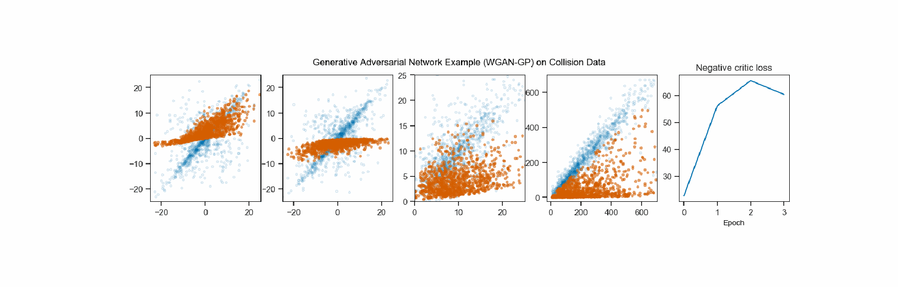
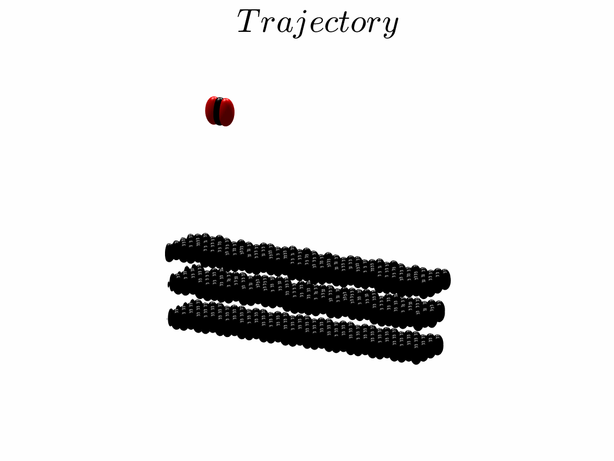

# Implamentation of conditional WGAN by Tensorflow 2.X
Using conditional GAN to simulate molecular diffuse reflection, 
the condition is the incident velocity vector [*cx*, *cy*, *cz*]<sub>in</sub> of gas molecule,
and the output of the generator is the reflection velocity vector [*cx*, *cy*, *cz*]<sub>out</sub> of gas molecule.
The cGAN is using the
improved [Wasserstein GAN (WGAN-GP)](https://arxiv.org/abs/1704.00028). Based on the codes from the
repositories of [Jan Kremer](https://https://github.com/kremerj/gan) (1D Gaussian).
 
In the above figure, the horizontal axis represents the incident values and the vertical axis represents the reflection values.
The 3 first figures show velocity at x, y, z direction, the 4th figure shows kinetic energy 
(*E*<sub>k</sub> = cx<sup>2</sup>+cy<sup>2</sup>+cz<sup>2</sup>). The last figure is the negative loss of the discriminator.

## Context
In the shale gas industry, there is a technology called "Enhanced oil recovery". 
With this technology, we can inject CO<sub>2</sub> into oil fields to increase oil or natural gas production and store CO<sub>2</sub> both to maintain the mechanical stability of the reservoir.
Since gas molecules are adsorbed at the surface of the rocks pores at the nanometer scale, the velocity of the gas molecules after reflection at the interface will change（like the following figure）.
This phenomenon can fundamentally affect the diffusion of gas molecules.



## Organization fo the repository

The main scripts is **"cWGAN.py"**, 
**"WGAN.py"** is an implementation without condition i.e. both incident and reflection velocities are generated.
The folder *CollisionData* gathers all collision data simulated by molecular dynamics. 
See [this](https://www.researchgate.net/publication/327466365_Collision_data_of_He_and_Ar_gas_on_gold_surface) for more information of data.
## To run the code:

### 1) Install the packages 

```
pip3 install -r requirements.txt
```

### 2) Run GAN

```
python3 cWGAN.py
python3 WGAN.py
```

### 3) More details see notebooks
```
cWGAN_collision.ipynb
WGAN_collision.ipynb
```
## Other generative models for the collision problem:
Non-paramater: [Non-parametric wall model and methods of identifying boundary conditions for moments in gas flow equations](https://aip.scitation.org/doi/10.1063/1.5016278)

Non-paramater: [Helium and Argon Interactions with Gold Surfaces: Ab Initio-Assisted Determination of the He−Au Pairwise Potential and Its Application to Accommodation Coefficient Determination](https://pubs.acs.org/doi/10.1021/acs.jpcc.8b03555)

Guassian Mixture Model: [Prediction of thermal conductance and friction coefficients at a solid-gas interface from statistical learning of collisions](https://hal.archives-ouvertes.fr/hal-01873261)
